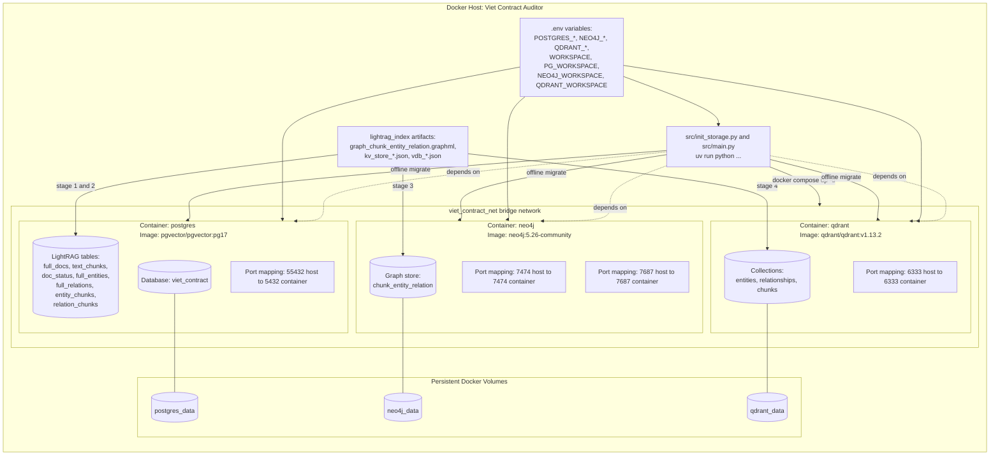

# Viet Contract Auditor

Hệ thống hỗ trợ rà soát hợp đồng tiếng Việt theo luật hiện hành, theo hướng kiến trúc RAG chuyên biệt cho pháp lý Việt Nam.

## 1. Mục tiêu hệ thống

- Input: hợp đồng (PDF/Word/TXT) và kho văn bản pháp luật.
- Output kỳ vọng: danh sách điều khoản có rủi ro pháp lý, căn cứ pháp luật liên quan, và gợi ý chỉnh sửa.
- Trọng tâm hiện tại: chuẩn hóa dữ liệu luật + kiến trúc lưu trữ production cho LightRAG.

## 2. Hiện trạng kiến trúc (as-is)

### 2.1 Trạng thái theo phase

- Phase 1 (ETL + semantic chunking): đã hoàn thành, có dữ liệu đầu ra ổn định.
- Phase 2 (knowledge graph): đang trong quá trình phát triển. Script export graphml đã sẵn sàng, các file json payload cho nodes/edges đã được tạo
- Phase 3 (graph/vector storage production + migration): đã triển khai hạ tầng và script migrate offline.
- Phase 4 (LangGraph multi-agent audit pipeline): chưa tích hợp trong `src/`.
- Phase 5 (UI): chưa triển khai.
- Phase 6 (đánh giá mô hình/evaluator): chưa triển khai.

### 2.2 Kiến trúc logic hiện tại

```text
Nguồn luật (HF + local txt)
	|
	v
src/data_ingestion.py
	|
	v
src/semantic_chunker.py (split theo Điều/Khoản)
	|
	v
data/processed/processed_legal_chunks.json
	|
	v
lightrag_index/* (graph + kv + vdb artifacts)
	|
	v
src/init_storage.py (offline migration, no LLM API)
	|
	+--> PostgreSQL (KV + doc status)
	+--> Neo4j (knowledge graph)
	+--> Qdrant (vector collections)
```

### 2.3 Kiến trúc runtime storage (production step hiện tại)

- PostgreSQL (pgvector image): lưu KV stores và document status cho LightRAG.
- Neo4j 5.26-community: lưu đồ thị chunk-entity-relation.
- Qdrant v1.13.2: lưu embeddings cho entities, relationships, chunks.
- Docker Compose: chạy đồng thời 3 dịch vụ với volume persistent.

### 2.4 Deployment architecture (containers + network + volumes)



Ghi chú vận hành:

- `src/init_storage.py` là entrypoint migration offline, không cần OpenAI API key.
- Network nội bộ dùng service name (`postgres`, `neo4j`, `qdrant`) trong Docker; host local dùng port map ở trên.
- Volumes giữ dữ liệu bền vững qua restart/recreate containers.

## 3. Cấu trúc repository

```text
src/
  data_ingestion.py      # Nạp dữ liệu luật từ HuggingFace + local txt
  semantic_chunker.py    # Chunking theo cấu trúc pháp lý Việt Nam
  main.py                # Orchestrator ETL Phase 1-2
  init_storage.py        # Migrate artifacts vao production storages (offline)

data/
  raw/                   # Van ban luat nguon
  processed/
    processed_legal_chunks.json
    chunking_stats.json

lightrag_index/          # Artifact dau ra LightRAG de migrate
  graph_chunk_entity_relation.graphml
  kv_store_*.json
  vdb_*.json

docker-compose.yml       # Neo4j + Qdrant + PostgreSQL
```

## 4. Luồng xử lý dữ liệu chi tiết

### 4.1 Phase 1-2: ETL luật

1. `src/data_ingestion.py` tải văn bản luật từ:
- Tier 1: `NghiemAbe/Legal-Corpus-Zalo` (các law_id cấu hình sẵn).
- Tier 2: file `.txt` trong `data/raw/`.

2. `src/semantic_chunker.py` chunk theo luật Việt Nam:
- Split chính tại `Điều X.`.
- Điều dài thì tách theo khoản.
- Điều ngắn thì gộp có kiểm soát.

3. `src/main.py` ghi output:
- `data/processed/processed_legal_chunks.json`
- `data/processed/chunking_stats.json`

### 4.2 Phase 3 hiện tại: Offline storage migration

`src/init_storage.py` đọc trực tiếp artifact trong `lightrag_index/` và migrate theo 4 stage:

1. Upsert KV/doc status vào PostgreSQL.
2. Upsert doc-level entity/relation payloads + chunk tracking vào PostgreSQL.
3. Import graph nodes/edges từ GraphML vào Neo4j.
4. Import vectors (entities/relationships/chunks) vào Qdrant từ NanoVectorDB artifacts.

Đặc điểm quan trọng:

- Không gọi OpenAI API.
- Không chạy extraction/ainsert.
- Dùng dữ liệu precomputed để tái dựng storage production.

## 5. Cách chạy theo trạng thái hiện tại

### 5.1 Chạy ETL Phase 1-2

```bash
uv run python src/main.py
```

### 5.2 Khởi động storage services

```bash
docker compose up -d
```

### 5.3 Migrate offline vào production storages

```bash
uv run python src/init_storage.py
```

Kết quả mong đợi khi thành công:

- Log hoàn tất import KV.
- Log hoàn tất import graph (nodes/edges).
- Log hoàn tất import vectors cho 3 namespace.
- Dòng kết thúc: `Offline storage migration completed successfully (no LLM API calls).`

## 6. Biến môi trường chính

Thiết lập trong `.env` (không commit file thật lên git):

- `WORKSPACE`
- `LIGHTRAG_WORKING_DIR`
- `POSTGRES_HOST`, `POSTGRES_PORT`, `POSTGRES_USER`, `POSTGRES_PASSWORD`, `POSTGRES_DATABASE`
- `NEO4J_URI`, `NEO4J_USERNAME`, `NEO4J_PASSWORD`
- `QDRANT_URL`, `QDRANT_API_KEY`
- `PG_WORKSPACE`, `NEO4J_WORKSPACE`, `QDRANT_WORKSPACE`

## 7. Ranh giới kỹ thuật hiện tại

- `src/` đang tập trung vào ETL + migration storage, chưa chứa flow audit contract đa agent.
- Bước suy luận pháp lý tự động (violation detection, citation, suggested rewrite) là scope Phase 4 trở đi.
- Kiến trúc hiện tại đã sẵn nền tảng production storage để nối retrieval/audit layer ở bước tiếp theo.

## 8. Hướng phát triển gần nhất

1. Gắn retrieval pipeline đọc trực tiếp từ PostgreSQL + Neo4j + Qdrant workspace production.
2. Triển khai LangGraph agents: Router -> Retrieval -> Audit -> Report Generator.
3. Định nghĩa evaluator bộ chỉ số legal recall/precision và citation faithfulness.
